# Hello,

This is a quick guide to using the sBitx v2 radio. The radio is under
constant development and the latest version of this guide will be
available on https://github.com/afarhan/sbitx/doc/hellov2.md.

The sBitx v2 is the evolution of the development edition launched in 2022. As a software defined radio should be, expect constant changes
to the user interface. This document will be constantly revised to reflect
the changes in the user interface, newer modes, etc. The latest version
of this manual as well as the software will always be available on
https://github/com/afarhan/sbitx.

Unlike other closed source and proprietary radios, the sBitx is entirely
open source, from its circuits to the software. HF Signals happens to
be just a company that commercially produces kits and board based on
the bitx designs. Others are invited to produce their own version of
sbitx and sell them as long as their derived work remains open source
as well.

### Acknowledgements

As is with most science and free software, this work builds on previous
works. In particular, I am grateful to Phil Karn, KA9Q for pointing me to
convolution method of SDR, Bob Larkin, W7PUA, for his seminal paper
describing the DSP-10 SDR which was the architecture we have followed with sBitx and Wes, W7ZOI for being the elmer and direct
contributor to so many circuit blocks used here.

Hans, G0UPL, probably invented the LPF switching using the1N4007s
that makes this such a silent radio, Don, W6JL built the first power
amplifier with IRFZ24N and we built upon his work as well as his
detailed study of using the 1N4007s as RF switches.

These are all direct contributors to the sBitx.

Finally, the amazing bunch at bitx20@groups.io that kept the flame
burning with unstable development journey and hung on till the end.
They made numerous contributions including the fixes to the PA by
Allison, patches by Anthony and many other contributors, This is the as
beautiful as a collaborative free software project gets,

### A Different Beast

Expect the sbitx to be a different radio from the ones that you are used
to.

- **Where did it go?** The user interface is dynamic so you won’t
see all the controls all the time. When operating SSB, you won't’
see a control to set CW sending speed and when operating
CW, you won’t see the mic gain.

- **It is HTML.** The user interface is written in HTML which was
designed for documents, not radio. However, it is our best bet
as it will be so easy to change the user interface with rudimentary HTML, javascript and CSS skills. Read the chapter
on hacking the sbitx.

- **Four wheels are enough**. Just like adding two more wheels to
a four wheeler doesn’t radically improve performance unless
you are going to Mars in a rover. Similarly, there is enough
performance in the sBitx for most of your work. Where it excels
is how easy it is to use the radio and concentrate on operating
rather than getting lost in confusing controls.

- **Ask for help**. These are early days for integrated radios, we
will all learn from this process. Join the bitx20@groups.io and
ask questions.


## Setting up the sBitx

### Antenna

The sBitx can withstand up to 2.0 SWR of antenna mismatch. It is best to use a well matched antenna that keeps the SWR below 1.5 for best results.

### Powering up the radio.

You will need a low noise power supply rated for 12 to 13.8v capable of
delivering at least 10 A of current. At HF Signals, we use a meanwell
model LRS-150-12. This is no official endorsement but just comment
on the kind of power supply we use, We crank up the voltage with the
small preset on the power supply to give us about 13.5V of voltage.

The power connector on the sBitx is an XT60. This is now a common
high amperage connector popular among the drone and r/c flyers. You
will get a mating connector for this in your kit that can be soldered to
any other kind of connector you may have on your power supply.


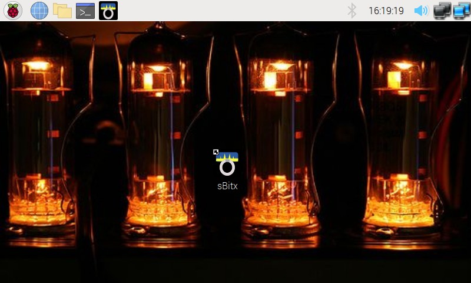

Upon switching your radio, in a few seconds, the raspberry pi desktop
will appear. Touch the sbitx icon to launch the radio.

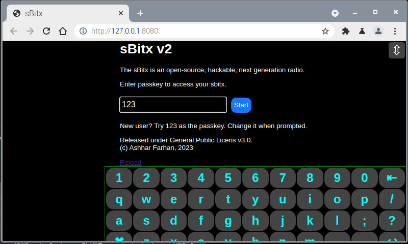

The sBitx application will launch the browser. You will need to type in
the passkey. The initial passkey is “123”. You can use the on-screen
keyboard to type it in or use an attached physical keyboard. Press `Start`

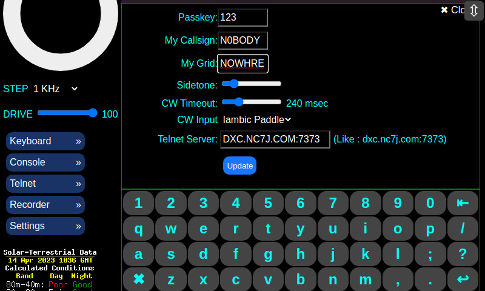


As a first time user, you have to add some basic information to your
radio.

- Press on the `Settings` button on the left column to open the
Settings Panel
- Enter your callsign and grid location (use the onscreen
keyboard or a plugged-in physical keyboard)
- Press `Update`

Your radio is now configured for all modes.

## Basic Operations

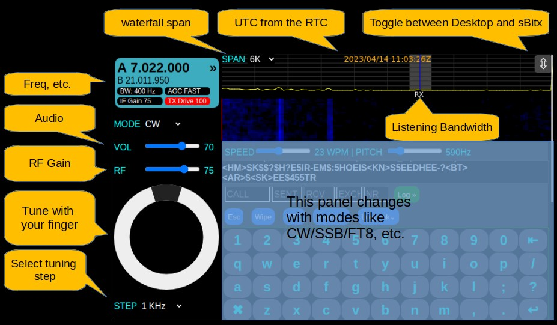

### Common controls

The controls column is on the left. Only the basic controls are visible on
all modes. In the column. If you scroll down the display, you will see
more items on the left column.

The controls work with the function knob (the physical knob on the top
right corner of the sbitx) as well as on screen.

For instance, when you select the VOL(Volume) control with your finger
or mouse, you can use the function knob to change the setting as well
as drag it on the screen to a new loudness.

**Frequency Display.** This is on the top left of the screen. It shows the
frequency of operation, if your RIT or SPLIT has been switched on,
current AGC and bandwidth settings. Clicking/Touching on this will
open up more controls that are explained in the next section.

- **Mode** switches between various modes like CW/SSB/FT8,
etc.
- There are many ways to tune your sBitx. You can use the
physical knob or you can use the on-screen tuning dial to spin
around. The tuning rate is set by the STEP control located right
beneath the on-screen tuning dial.
- **RF** Gain should be kept to a point where you can barely see
the band noise level above the base-line. This provides the best
audio.

- The frequency on the dial corresponds to the centerline of the
spectrum and waterfall. The gray strip shows the current
listening bandwidth.

- **UTC time**. The current UTC time is display on the top center.

- **The double arrow icon** is always on the top right corner. if
you click it once, the SDR window will become a regular
browser window and allow you to switch to other applications
and software, clicking on it again will return the sBitx window to
full screen.

- TX **Drive** Just under the on-screen tuning dial there is TX drive
control to control the transmit drive from 1 to 100. Note that this
control is drive and it is not the reading of power in watts. The
exact power in watts will show on the transmit meters when
transmitting.

You will note that many controls such as bandwidth, AGC, etc. are
missing from the left column. These are accessed in a hidden panel by
touching on the frequency display:

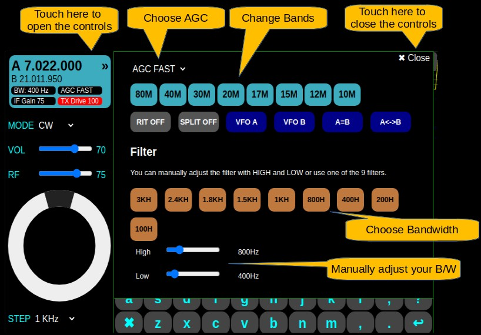

### Band stacked VFOs

There are four frequency memories on each band, this is called band
stacking. By clicking on each band switch repeatedly, you will cycle
through each of them. When you stay on a particular frequency and
tune around, the band stack is updated to that frequency. It is more
intuitive to just use it rather than read about it.


### RIT

The usual RIT feature is available. The RIT tuning range is restricted to
25 KHz from the transmit frequency. For larger splits, use the SPLIT
function discussed below.

### VFOs A & B

Two VFOs are available to allow you to work split, or just remember
one frequency and quickly check on another. Each of the two VFO
buttons switch to the VFO A or B.

### Split Operating

Frequently, while DXing or Contesting, the operation is split to different
frequency for transmit and receive. Though RIT can be used for this, a
better option is to set the VFO A to the transmitting frequency and use
the VFO B to listen.

- Turn on the SPLIT by touching the **SPLIT** button. Now, VFO A
will be your transmitting frequency and VFO B will be your
listening frequency.

- The A and B frequencies may be really away from each other.
You can set them to the current frequency on display by
touching on **A=B** button.

- At times you may want to swap the transmitting and receiving
frequencies. This is done with the **A<>B** button.

### Filters

There are nine prebuilt filters available to choose from. On modes like
CW/RTTY/PSK31, the filters will center around the PITCH frequency
which is used to transmit as well as decode. More about the PITCH
control on the CW section.

For pesky QRM from stations close to your contact’s frequency, you
may use the manual HIGH and LOW control to move the bandwidth
around to eliminate the QRM manually.

#### Tip: Choosing a bandwidth

Having a very narrow filter, let’s say 200 Hz while tuning around with a
step of 1 KHz will result in missing many signals. Keep a check on your
tuning rate when using a narrow filter.

Usually, when hunting for stations, it is a good idea to keep the
bandwidth of the filter wide.

A width of 1.5 KHz is recommended for CW and other data modes
while 2.4 KHz is a good choice for SSB work.

Once a station is located, center it inside the bandwidth strip on the
spectrum for best decoding and pleasing audio.


## Logging and the Logbook

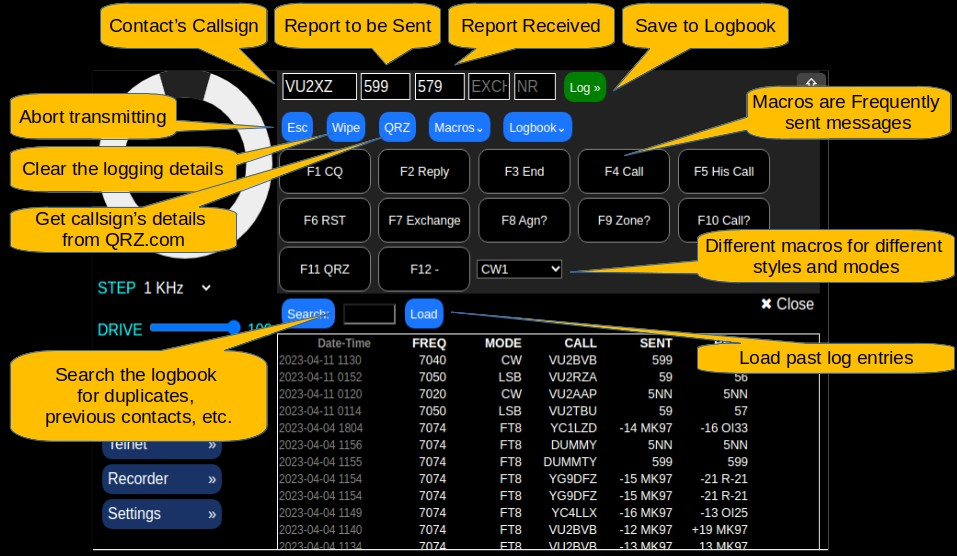

sBitx has a simple logger, those used to the N1MM logger will find this
familiar.

The top line of the logger has a series of empty boxes.

- **Entering a QSO.** You enter the contact’s callsign in the first
box, the received signal and the sent signal in the first three
boxes. The other two are used only during contests, they will be
explained elsewhere.
When the first three boxes are filled, you can press the LOG
button to enter the QSO into the logbook.

- **View Log** Press the Logbook button to view the logbook, The
logbook can be closed by pressing the x close button on the
top right of the logbook panel.

Press the Load button to load more QSOs in the logbook. It
loads only the last 50 in the beginning.

- **Search the Logbook.** Enter the callsign or part of the callsign
to search and press the Search button. To go back to the full
logbook, Press Load.

### Macros

Macros add a lot of fun, ease and speed to your CW/RTTY/PSK
operations. They work with the contact’s callsign and reports you have
entered in the logger entry boxes show on top of the picture above.

The macros are available on function keys of any attached keyboard,
they can also be used by pressing the macro buttons. You can have a
maximum of 12 macros defined. These are stored in text files with .mc
extension the directory `/home/pi/sbitx/web`. You can view and edit
them. It is recommended that instead of editing them directly, you
should make a copy and give it a new name, keeping the extension
to `.mc`.


- All the macro files available are listed in the dropbox next to the
macro buttons. You can choose a different macro file
depending upon what kind of operating you want to do.

- The macros will substitute your callsign, grid, the contact’s filled
in callsign, report (from the logger boxes).

This is best explained with an example. Choose CW1 from the drop
list. Now,


- **F1 CQ**. This will call CQ with your callsign as it was entered in
the settings panel

- **F2 Replay**. First fill the contact’s callsign and their signal
report, then pressing this will generate a message that is reply
to the contact with your callsign, etc. In the above case, it will
be generate the message:

```
rr VU2XZ de VU2ESE. ur rst599 599. tnx fer qso.
hw cpy? VU2XZ de VU2ESE kn
```

(Here the sbitx operator’s callsign is assumed to be VU2ESE,
the contact’s callsign and report were picked up from the logger
window).

- **Log** When the QSO is confirmed, you can press the **Log**
button and the logbook will be updated.

- **Wipe** You can clear the logger window without having the
delete individual entry boxes by pressing the **Wipe** button.

- **Esc** You can interpret a transmission of a macro generated
message by pressing the Esc button or pressing the Escape
key on the physical keyboard.


## CW

The sBitx is a great CW machine. It has some amazing features for the
CW operator


- CW filters from 100 Hz to 3 KHz with minimum ringing
- Noiseless, electronic T/R and band switching with diodes.
- Fldigi’s CW decoder works in the background
- Intersperse paddle/straight key sending with keyboard and
macros
- Integrated logger with macros to generate common messages.

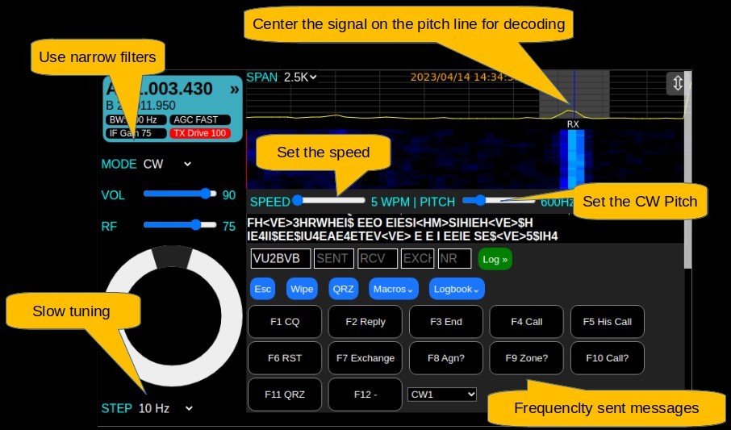

- Using the decoder is easy, just tune the interesting signal
exactly onto the pitch line
- The CW PITCH control sets your sending and receiving pitch.
- Use narrow filters to cut out the band noise and QRM

- With narrow filters, when hunting stations, use 100 Hz or 10 Hz
tuning rate and keep the span to 10K or less

- In addition to the paddle or straight key, you can also transmit
CW from the on-screen keyboard an attached physical
keyboard.

- Learn to use macros, they save effort (see Logging and the
Logbook section)


## SSB

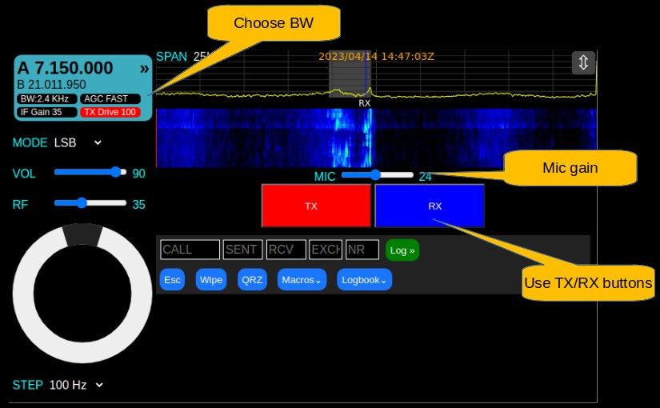

The sBitx kit comes with an in-built as well as a handheld mic. The
3.5mm audio jack connector can take any normal microphone that
doesn’t have a PTT button too. The on-screen buttons can substitute
for the PTT.

Note that instead of one PTT button there are separate buttons to start
transmission and to go back to listening. This is done so that your
hands are free to write down things, tune the antenna, type the
callsigns into the logger, etc.


- Choose a bandwidth greater than 1.5 K, 2.4 KHz is a good
bandwidth for voice
- The mic gain with the supplied hand-held microphone should be
24 or 25.
- When using the internal mic, increase the mic gain to 50.

## FT8

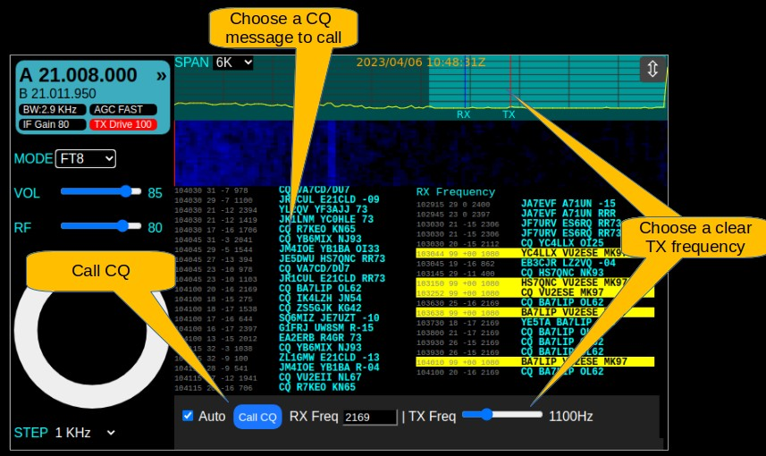

FT8 is considered to be tough to set up with a regular radio and a
computer. However, with sbitx, it is very easy. Here is how:


- Tune to the FT8 frequency, set the bandwidth to 3 KHz and
listen for a while watching the waterfall for spots where no one
is transmitting.
- Move the **Tx Freq** using the slider until the tx line on the
spectrum is positioned at a relatively unoccupied frequency.
- The left window shows the band activity. Click on any
interesting callsign calling CQ to begin the call. Sit back and
watch sbitx complete it for you. The logger window will
automatically fill the callsign and signal reports
- To call CQ, press the **Call CQ** button and the CQ will start at
the next cycle.


#### Time synchronization

The FT8 relies on starting the transmission/reception at every 15
second boundary. It is vital that the sbitx Real-time clock is properly
synchronized. The RTC synchronizes itself using the NTP to within a
few milliseconds each time there is Internet connectivity.

To maintain proper time, connect the sbitx to the Internet through Wifi
or Ethernet and reboot and run sbitx. The correct UTC time should
automatically display at the top.


## RTTY/PSK31

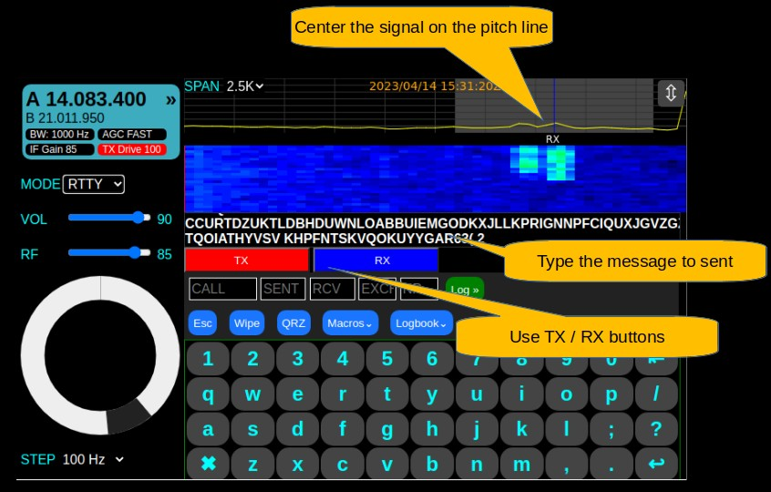

The RTTY and PSK31 modes of sBitx are implemented using fldigi that
runs in the background.


- Align the signal being received to the RX pitch line on the
window
- Press TX button and start typing to transmit
- Press RX button to end the transmission
- As in CW, you can use the Macros to send standard messages

## DX Spotting, Clusters

Many hams enjoy exchanging messages to each other over the
internet about the stations they are spotting on the band. This helps
you hunt for specific DX stations or to find out the activity in general.

These stations use telnet to get the stream of these messages.

You will need to have sbitx online to use this.

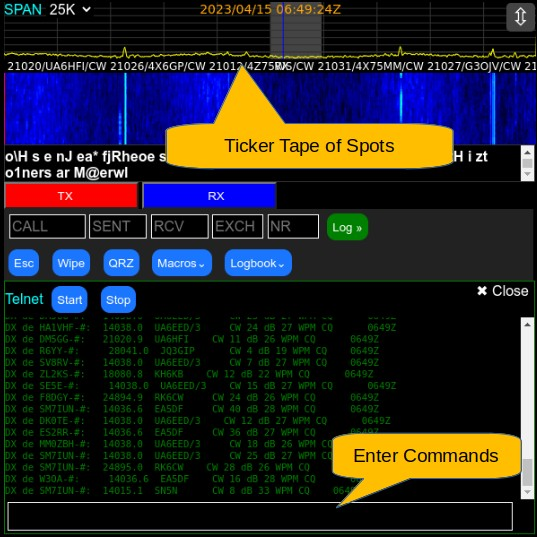

- Choose Telnet from the left column to open the telnet panel.
- Press **Start** button to start streaming messages.
- A ticker tape of the latest spots near your operating frequency
will stream under the spectrum.
- You can enter the dx cluster commands in the edit window of
the telnet panel. Each server has a different set of commands.

You can set your dx cluster server through the Settings panel.

If you are interested in learning more about dx clusters, etc. Find the
information on the Internet, including commands to filter the spots, etc.

This version of sbitx does not support sending your spots to the cluster
network yet.

## Audio Recorder

It is good to be able to record some brag tapes of rare or important
contacts. The recorder with sBitx will place all the recorded files in
`/home/pi/sbitx/audio`. Each audio file is named by the time at which it
was recorded.

Using the recorder is easy.


- Open the recorder by pressing on the Recorder button in the
left column.
- Press Record button to start recording
- Press Stop to stop recording

To retrieve / play the recordings, you will have to switch from sBitx to
other raspberry pi applications (like the file manager) to view and play
the files.
